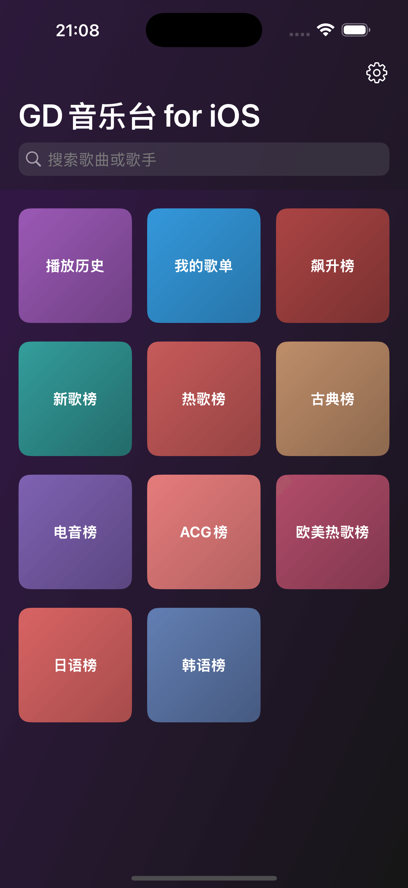
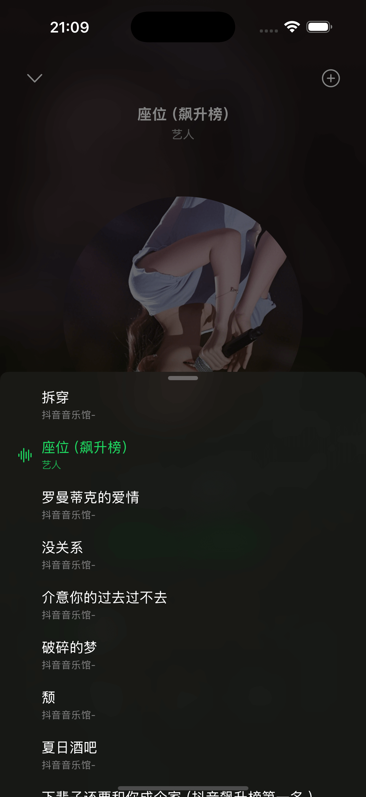
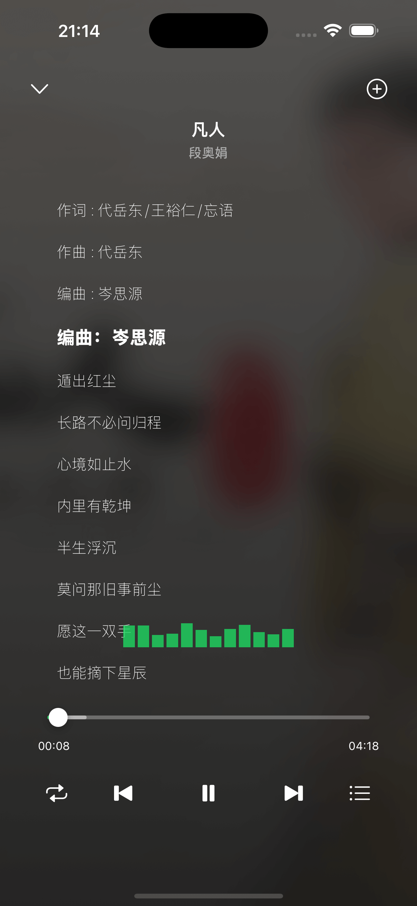
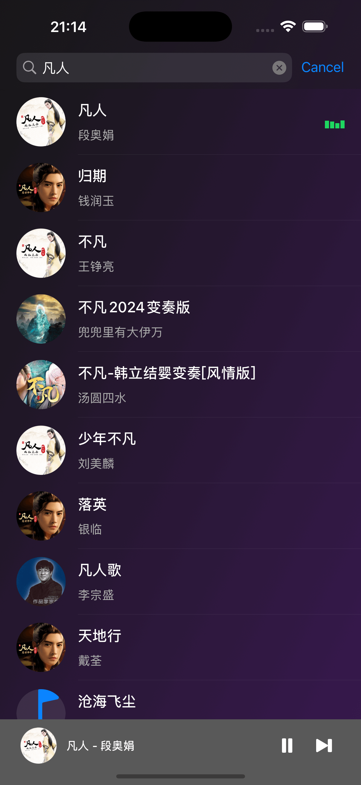

## GD音乐台 for iOS

得益于`AI Coding`以及 [GD音乐台](https://music.gdstudio.xyz/) 的API支持，这是一款功能丰富的iOS音乐播放器。

### 功能介绍

这款音乐播放器提供了完整的音乐播放体验，包含以下核心功能：

#### 1. 首页分类浏览
- **主页**: 应用启动后进入首页，提供多种音乐榜单和功能入口。
  
- **分类导航**: 包含播放历史、我的歌单、飙升榜、新歌榜、热歌榜、古典榜、电音榜、ACG榜、欧美热歌榜、日语榜、韩语榜等多个分类，方便快速找到喜欢的音乐。

#### 2. 音乐列表与搜索
- **音乐列表**: 点击任意分类进入音乐列表页面，展示该分类下的所有音乐。
  
- **分页加载**: 支持分页加载更多音乐，流畅浏览大量数据。
- **搜索功能**: 通过顶部搜索栏可搜索任意关键词，查找特定音乐。
  

#### 3. 播放器界面
- **全屏播放**: 点击任意音乐进入全屏播放界面，提供沉浸式体验。
  
- **歌词显示**: 实时显示歌词，并高亮当前播放行。
- **音频可视化**: 具有动态频谱视觉效果，增强听觉体验。
- **播放控制**: 支持播放/暂停、上一首、下一首、播放模式切换（顺序、随机、单曲循环）等操作。
- **进度控制**: 通过进度条可拖拽快进/快退，精确控制播放位置。

#### 4. 播放列表管理
- **当前播放列表**: 可查看当前正在播放的列表，并进行播放控制。
  
- **历史记录**: 查看播放历史，快速回到听过的音乐。
  
- **自定义歌单**: 创建和管理个人歌单，收藏喜欢的音乐。
  
  

### 安装与使用

1. 克隆项目到本地。
2. 使用Xcode打开 `MusicPlayer.xcworkspace`。
3. 安装CocoaPods依赖（如未安装）：`pod install`。
4. 连接iOS设备或启动模拟器。
5. 编译并运行项目。

**注意**: 本项目依赖于GD音乐台的API服务,此项目仅供学习研究之用~